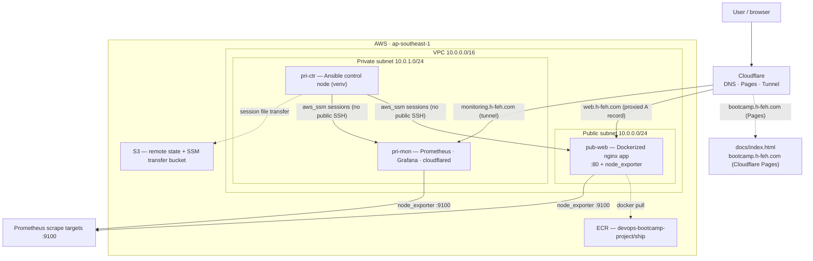

# devops-bootcamp-project

A DevOps bootcamp capstone: provision a 3-node AWS stack with **Terraform**, configure and orchestrate it with **Ansible** over **AWS SSM** (no public SSH), deploy a Dockerized web app from **ECR**, and monitor the whole thing with **Prometheus + Grafana** exposed through a **Cloudflare Tunnel**.

## 🔗 Live links

| Link | Purpose |
| --- | --- |
| [web.h-feh.com](https://web.h-feh.com) | The application — a Dockerized nginx web app running on the public EC2 node (`pub-web`), fronted by a proxied Cloudflare A record. |
| [monitoring.h-feh.com](https://monitoring.h-feh.com) | Grafana dashboards for Prometheus metrics — served from the private monitoring node (`pri-mon`) through a `cloudflared` tunnel. |
| [bootcamp.h-feh.com](https://bootcamp.h-feh.com) | The project's instruction page (`docs/index.html`) — the static landing page hosted on Cloudflare Pages. |

## 🧰 Technology stack

| Technology | Where it is used |
| --- | --- |
| **Terraform** | Infrastructure as code: VPC/subnets, security groups, EC2 instances, S3 buckets, Cloudflare DNS record (`terraform/`). Renders the Ansible inventory and Prometheus config from live output. |
| **Ansible** | Configuration management and orchestration. Three playbooks: bootstrap the control node, bring up monitoring, and deploy the web app (`ansible/`). |
| **AWS SSM** | All remote access. Ansible connects to every node with `ansible_connection=aws_ssm` — no public SSH needed, even for private nodes. |
| **Docker** | Runtime for the web app and the monitoring stack (Prometheus, Grafana, cloudflared). |
| **Docker Compose** | Defines the Prometheus + Grafana + Cloudflare Tunnel stack on the monitoring node (`ansible/compose.yaml`). |
| **Amazon ECR** | Stores the web app image (`devops-bootcamp-project/ship`), pulled by the web node at deploy time. |
| **Prometheus** | Scrapes node_exporter metrics from the web and monitoring nodes. |
| **Grafana** | Dashboards for the scraped metrics; auto-provisioned from `ansible/grafana-provisioning/`. |
| **node_exporter** | Exports OS/host metrics on each node (ports 9100/9090 internally). |
| **Cloudflare** | DNS (proxied A record → web app), Pages (hosts this project's static docs page), and Tunnel (private Grafana reachable publicly). |
| **nginx** | Serves the web app inside the container runtime stage. |
| **GitHub Actions** | CI that lints the Terraform on push (`.github/workflows/deploy.yaml`). |

## 🏗️ Architecture



All resources live in `ap-southeast-1`:

- **pub-web** (public, `t3.micro`) — runs the Dockerized web app on port 80; the web/ECR IAM role lets it pull from ECR.
- **pri-ctr** (private, `t3.micro`) — the Ansible control node in a venv (`/opt/ansible-venv`) with the CLI, SSM plugin, roles and collections installed by the bootstrap playbook; runs the deploy from `/opt/ansible`.
- **pri-mon** (private, `t3.micro`) — Docker Compose stack: Prometheus, Grafana, and a `cloudflared` tunnel that reads its token from an SSM parameter.

Each node runs under a least-privilege IAM role so it can only do its own job — see `docs/index.html` and below.

## 📂 Repository layout

- `terraform/` — providers, VPC, security groups, EC2 instances, S3 (remote state + SSM bucket), Cloudflare DNS, and templates (`inventory.ini.tftpl`, `prometheus.yml.tftpl`) that render Ansible/Prometheus files.
- `ansible/` — playbooks, `ansible.cfg`, Docker Compose stack, and Grafana provisioning.
- `app/` — multi-stage Docker build (node → nginx) for the web app image.
- `docs/` — static instruction page served at bootcamp.h-feh.com.
- `.github/workflows/` — CI pipeline (Terraform lint).

## ⚙️ Deployment

> Full, annotated walkthrough (including IAM setup, prerequisites, and caveats) lives at **bootcamp.h-feh.com** (`docs/index.html`).

1. **Set secrets** — create `terraform/terraform.tfvars` with the variables from `terraform/variables.tf` (`cloudflare_api_token`, `cloudflare_zone_id`, `cloudflare_record`). IAM roles and an ECR repo must already exist.
2. **Apply the infrastructure**:
   ```bash
   cd terraform/
   terraform init
   terraform plan -out=tfplan
   terraform apply tfplan   # generates ../ansible/inventory.ini + prometheus.yml
   terraform output         # public/private IPs + SSM start-session commands
   ```
3. **Bootstrap the control node** (from your local machine, over SSM):
   ```bash
   cd ansible/
   ansible-playbook playbook-setup-ansible.yaml
   ```
   This installs Ansible, the CLI, SSM plugin, roles and collections on `pri-ctr` and copies the configs to `/opt/ansible`.
4. **Deploy monitoring, then the web app** (from the control node):
   ```bash
   aws ssm start-session --target <pri-ctr-id>   # terraform output ssm_pri-ctr
   cd /opt/ansible
   ansible-playbook playbook-mon-stack.yaml      # Prometheus + Grafana + tunnel
   ansible-playbook playbook-web-stack.yaml      # pull app from ECR, run on :80
   ```

### 🧹 Cleanup

```bash
cd terraform/
terraform destroy
```

(This removes the Cloudflare DNS record; ECR images and any manually created IAM/S3 resources are left behind.)